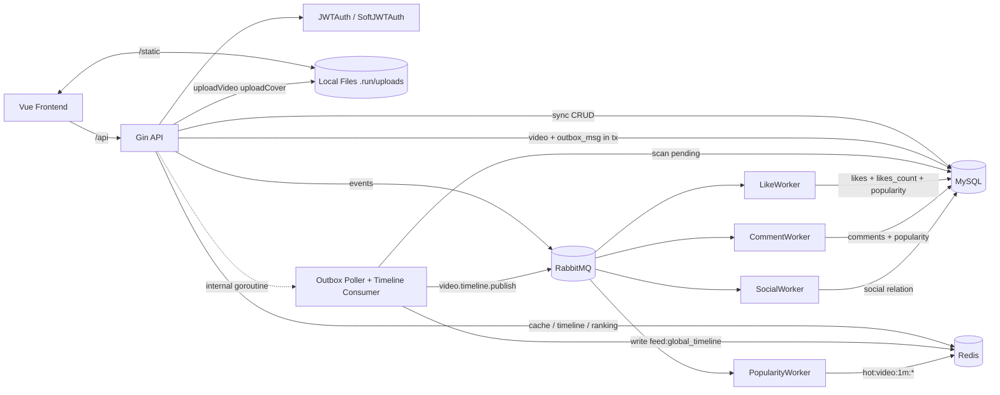
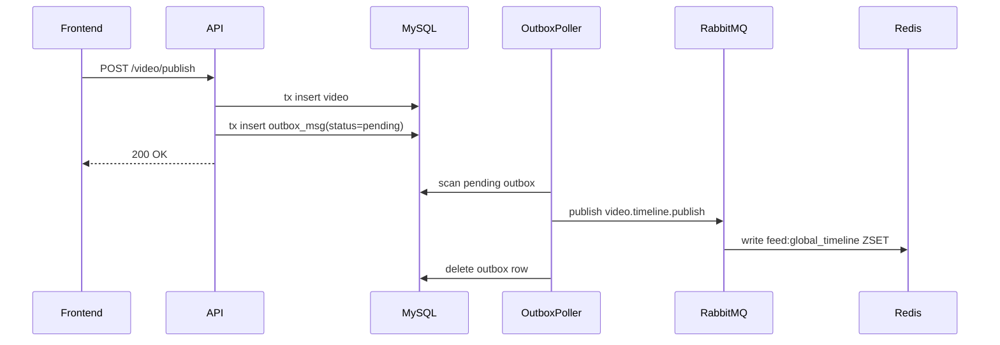

# ARCHITECTURE

本文件描述 `feedsystem_video_go` 的当前代码架构，**以仓库现有实现为准**，不是对设计稿的重复转述。

相关资料：
- [README.md](README.md)
- [feedsystem_video_go项目设计.md](feedsystem_video_go项目设计.md)
- [picture/整体架构.png](picture/整体架构.png)
- [picture/整体流程.png](picture/整体流程.png)

## 1. 系统概览

这是一个前后端分离的短视频 Feed 系统，核心能力包括：

- 账号：注册、登录、改名、改密、登出
- 视频：上传文件、发布视频、查视频详情、查作者视频列表
- 互动：点赞、评论、关注
- Feed：最新流、点赞排序流、热榜流、关注流
- 性能优化：Redis 缓存、RabbitMQ 异步消费、Outbox + Timeline

运行时主要由 6 部分组成：

1. `frontend/`：Vue + Vite 前端
2. `backend/cmd/main.go`：Gin API 进程
3. `backend/cmd/worker/main.go`：独立 Worker 进程
4. MySQL：业务主存储
5. Redis：鉴权缓存、详情缓存、关注流缓存、全局时间线、热榜 ZSET、限流计数
6. RabbitMQ：点赞/评论/关注/热度/时间线事件总线

## 2. 整体架构图

## 3. 目录与分层

### 3.1 后端分层

后端基本遵循：

`Handler -> Service -> Repository -> MySQL/Redis/RabbitMQ`

主要目录：

- `backend/cmd/`：进程入口
- `backend/internal/http/`：路由装配
- `backend/internal/account/`：账号模块
- `backend/internal/video/`：视频、点赞、评论、热度缓存
- `backend/internal/social/`：关注模块
- `backend/internal/feed/`：Feed 聚合与分页
- `backend/internal/worker/`：MQ 消费者、Outbox、Timeline
- `backend/internal/middleware/jwt/`：JWT 鉴权
- `backend/internal/middleware/redis/`：Redis 封装、锁、ZSET、限流基础能力
- `backend/internal/middleware/rabbitmq/`：MQ 封装与事件定义
- `backend/internal/db/`：数据库初始化与 AutoMigrate

### 3.2 前端分层

前端比较薄，主要职责是：

- 保存 JWT
- 发起 API 请求
- 维护页面状态
- 渲染 Feed/详情/账号/个人页

主要目录：

- `frontend/src/api/`：接口调用
- `frontend/src/stores/`：Pinia 状态管理
- `frontend/src/views/`：页面视图
- `frontend/src/components/`：页面组件

## 4. 启动与装配

### 4.1 API 进程

入口在 `backend/cmd/main.go`。

启动顺序：

1. 读取 `configs/config.yaml`
2. 初始化 MySQL
3. 执行 `AutoMigrate`
4. 初始化 Redis
5. 初始化 RabbitMQ
6. 启动 pprof
7. 调用 `internal/http.SetRouter(...)` 装配全部路由和依赖

`AutoMigrate` 会自动创建这几张核心表：

- `accounts`
- `videos`
- `likes`
- `comments`
- `socials`
- `outbox_msgs`

### 4.2 Worker 进程

入口在 `backend/cmd/worker/main.go`。

独立 Worker 进程会：

1. 初始化 MySQL
2. 初始化 Redis
3. 连接 RabbitMQ
4. 声明 4 类 topic exchange/queue
5. 启动 4 个消费者

对应消费者：

- `SocialWorker`
- `LikeWorker`
- `CommentWorker`
- `PopularityWorker`

### 4.3 路由装配

全部业务依赖在 `backend/internal/http/router.go` 中一次性组装。

路由分组：

- `/account`
- `/video`
- `/like`
- `/comment`
- `/social`
- `/feed`

其中：

- 强鉴权使用 `JWTAuth`
- 软鉴权使用 `SoftJWTAuth`
- 登录、注册、点赞、评论、关注写接口上挂了限流器

## 5. 核心模块职责

### 5.1 Account

职责：

- 注册账号
- bcrypt 哈希密码
- 登录签发 JWT
- 改名时换发新 JWT
- 登出与改密时撤销 token

实现特点：

- token 不只存在 JWT 本身，也会保存到 MySQL 的 `account.token`
- Redis 使用 `account:<accountID>` 缓存当前有效 token
- 鉴权中间件优先查 Redis，未命中再回源 MySQL，并回填 Redis

这意味着当前实现支持“单点登录式 token 撤销”，不是纯无状态 JWT。

### 5.2 Video

职责：

- 上传视频文件
- 上传封面文件
- 发布视频
- 获取视频详情
- 查询作者作品

实现特点：

- 文件保存到 `.run/uploads`
- `Gin.Static("/static", "./.run/uploads")` 暴露静态资源
- 视频详情使用 Redis 缓存 `video:detail:id=<id>`
- 发布视频不是直接写全局 Feed，而是 `video + outbox_msg` 同事务写库

### 5.3 Like

职责：

- 点赞
- 取消点赞
- 判断当前用户是否已点赞
- 查询当前用户点赞过的视频

实现特点：

- 写请求会优先发送两类 MQ 事件：
  - 点赞事件：用于 MySQL 持久化
  - 热度事件：用于 Redis 热榜增量
- 如果 MQ 不可用，会降级为同步直写 MySQL/Redis
- Worker 侧实现了幂等保护：
  - 点赞插入使用唯一索引
  - 取消点赞删除后才减计数

### 5.4 Comment

职责：

- 发表评论
- 删除评论
- 列出视频评论

实现特点：

- 发布评论时同样采用：
  - 评论事件写 MySQL
  - 热度事件写 Redis
- MQ 失败时降级同步写
- 删除评论当前逻辑支持异步删除，但删除后不回补热度

### 5.5 Social

职责：

- 关注
- 取关
- 查询粉丝列表
- 查询关注列表

实现特点：

- 当前代码并不是纯异步 social
- `SocialService` 会在尝试发 MQ 后，仍然同步写 MySQL
- `SocialWorker` 更像补偿/重复消费保护，而不是唯一写入口

这点和点赞/评论模块的异步化程度不同。

### 5.6 Feed

职责：

- `listLatest`：最新流
- `listLikesCount`：按点赞数排序
- `listByPopularity`：热榜
- `listByFollowing`：关注流

实现特点是本项目最核心的一层，见下文详细说明。

## 6. Feed 的实现方式

### 6.1 Feed 返回模型

Feed 并不直接返回 `video.Video`，而是聚合成前端直接可渲染的 `FeedVideoItem`：

- 视频基础信息
- 作者信息
- 点赞数
- 当前用户是否点赞

因此 Feed 本质上是一个“聚合查询层”。

### 6.2 最新流 `listLatest`

`listLatest` 的真实实现不是简单查 MySQL，而是：

1. 先读 Redis 全局时间线 `feed:global_timeline`
2. 如果时间线为空，用 `singleflight` 只让一个请求回源 MySQL 最近 1000 条并重建 ZSET
3. 热数据区直接按 ZSET 的时间分数取 videoID
4. 再通过 `GetVideoByIDs` 批量取视频实体
5. 如果页尾穿过热点边界，再补一段 MySQL 冷数据
6. 最后批量补 `is_liked`

这里实际用了两层优化：

- 时间线层：Redis ZSET
- 视频实体层：L1 本地缓存 + L2 Redis + L3 MySQL + singleflight

### 为什么这样做

- 刷推荐流时，排序结果比实体本身更热
- 先把“顺序”放到 Redis，再按 ID 查详情，比直接整页打 DB 成本低
- 热冷分离后，热点刷流走 Redis，深分页才回落 MySQL

### 6.3 点赞排序流 `listLikesCount`

排序规则：

- `likes_count DESC`
- `id DESC`

分页游标是复合游标：

- `likes_count_before`
- `id_before`

这样可以避免“点赞数相同导致翻页重复/漏数据”。

### 6.4 关注流 `listByFollowing`

查询方式：

1. 从 `socials` 子查询出当前用户关注的 `vlogger_id`
2. 查这些作者发布的视频
3. 按 `create_time DESC` 排序
4. 再聚合成 `FeedVideoItem`

缓存方式：

- key 类似 `feed:listByFollowing:limit=<n>:accountID=<id>:before=<cursor>`
- Redis 未命中时，用 `lock:<cacheKey>` 加互斥锁防击穿
- 没抢到锁的请求短暂轮询缓存结果

### 6.5 热榜 `listByPopularity`

热榜不是直接查 `videos.popularity`，优先走 Redis 滑动窗口：

1. 互动事件把热度增量写到分钟级 ZSET：
   - `hot:video:1m:<yyyyMMddHHmm>`
2. 查询热榜时，把最近 60 个时间窗 `ZUNIONSTORE` 成快照：
   - `hot:video:merge:1m:<as_of>`
3. 第一次请求返回 `as_of`
4. 后续翻页带同一个 `as_of + offset`
5. 这样整次分页过程基于同一个快照，避免热榜抖动

如果 Redis 不可用，则回退到 MySQL：

- `ORDER BY popularity DESC, create_time DESC, id DESC`

## 7. 写链路与异步化

### 7.1 视频发布链路

这是当前实现里最明确的 “事务写库 + 异步投递” 链路。

### 7.2 点赞链路

写点赞时有两条并行目标：

1. MySQL 持久化点赞关系与点赞计数
2. Redis 热榜增量

正常路径：

- API 发布 `like.events`
- API 发布 `video.popularity.events`
- 返回成功
- Worker 异步消费后更新 DB/Redis

降级路径：

- `like.events` 发布失败：同步写 `likes` 和 `videos.likes_count/popularity`
- `video.popularity.events` 发布失败：同步更新 Redis 分钟窗 ZSET

### 7.3 评论链路

与点赞类似：

- 评论写 MySQL 走 `comment.events`
- 热度写 Redis 走 `video.popularity.events`
- 任一 MQ 失败则同步降级

### 7.4 关注链路

当前实现更接近：

- 先尝试发 `social.events`
- 不论 MQ 是否成功，都会同步写 MySQL

所以 social 的 MQ 更像附加事件，而不是唯一落库通道。

## 8. Redis 的使用方式

当前主要 Key：

| 类别 | Key 模式 | 用途 |
| --- | --- | --- |
| 鉴权 | `account:<accountID>` | 当前有效 token |
| 视频详情 | `video:detail:id=<videoID>` | 视频详情缓存 |
| 视频实体 | `video:entity:<videoID>` | Feed 批量取详情时的实体缓存 |
| 全局时间线 | `feed:global_timeline` | 最新流排序 ZSET |
| 关注流缓存 | `feed:listByFollowing:...` | 关注流结果缓存 |
| 热榜分钟窗 | `hot:video:1m:<yyyyMMddHHmm>` | 热度增量桶 |
| 热榜快照 | `hot:video:merge:1m:<as_of>` | 稳定分页快照 |
| 限流 | `feedsystem:ratelimit:*` | 登录/注册/点赞/评论/关注限流 |
| 分布式锁 | `lock:<cacheKey>` | 防缓存击穿 |

Redis 还提供了两个通用基础能力：

- `SetNX + token` 分布式锁
- `INCR + EXPIRE` 窗口计数限流

## 9. RabbitMQ 的使用方式

当前 exchange / routing key：

| 模块 | Exchange | Routing Key |
| --- | --- | --- |
| 点赞 | `like.events` | `like.like` / `like.unlike` |
| 评论 | `comment.events` | `comment.publish` / `comment.delete` |
| 关注 | `social.events` | `social.follow` / `social.unfollow` |
| 热度 | `video.popularity.events` | `video.popularity.update` |
| 时间线 | `video.timeline.events` | `video.timeline.publish` |

消费端职责：

- `LikeWorker`：维护 `likes`、`likes_count`、`popularity`
- `CommentWorker`：维护 `comments`、`popularity`
- `SocialWorker`：维护关注关系
- `PopularityWorker`：维护 Redis 热榜分钟窗
- Timeline consumer：维护 `feed:global_timeline`

## 10. 前端如何接入后端

前端统一通过 `frontend/src/api/client.ts` 发请求：

- 自动加 `Content-Type: application/json`
- 如果本地有 token，自动带 `Authorization: Bearer <token>`
- 如果接口返回 `401`，会自动清掉本地 token

几个核心页面：

- `HomeView.vue`
  - 推荐 tab：`/feed/listLatest`
  - “hot” tab：`/feed/listLikesCount`
  - 关注 tab：`/feed/listByFollowing`
- `HotView.vue`
  - 真正的热榜页：`/feed/listByPopularity`

这意味着首页里的 “hot” 和独立热榜页不是同一套后端接口：

- 首页 hot：按点赞数排序
- 热榜页：按 Redis 热度快照排序

## 11. 当前实现与设计稿的几个关键差异

这些点在看代码时需要特别注意：

### 11.1 `listLatest` 强依赖 Redis 全局时间线

设计上可以理解成 “最新流可查 MySQL + 可缓存”，但当前代码实际是：

- 依赖 `feed:global_timeline`
- 由视频发布 Outbox 异步维护

所以它更接近“Redis 驱动的时间线服务”。

### 11.2 Social 不是纯异步

当前 `SocialService` 里：

- 会尝试发 MQ
- 但仍直接写 MySQL

Worker 只是再次消费同一事件。

### 11.3 热榜是两套概念并存

当前仓库中存在：

- `videos.popularity`：MySQL 总热度字段
- `hot:video:1m:*`：Redis 短期热榜窗口

所以：

- MySQL 更像兜底排序字段
- Redis 才是实时热榜主实现

### 11.4 Redis 在代码里“名义可选，实际部分路径强依赖”

例如 `FeedService.ListLatest` 会直接访问 `f.rediscache`。

因此在当前代码形态下，推荐部署时默认启用 Redis，不要把它当成完全可拔插依赖。

## 12. 一句话总结

这个项目的本质是：

**Gin + GORM 的业务主链路，MySQL 做事实存储，Redis 做时间线/热榜/缓存，RabbitMQ 做互动写扩散，Outbox 保证视频发布时间线最终进入 Redis。**

如果只抓最关键的实现点，可以记住三件事：

1. Feed 不是直接查表，而是聚合层
2. 互动写入不是单库直写，而是 MQ + 降级
3. 最新流不是简单按时间查 MySQL，而是 Redis 全局时间线 + Outbox 维护
