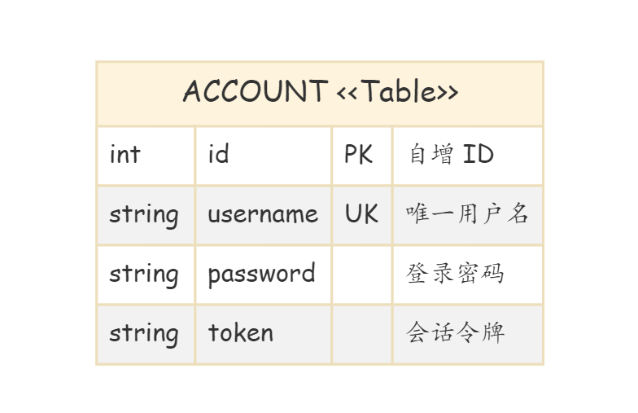
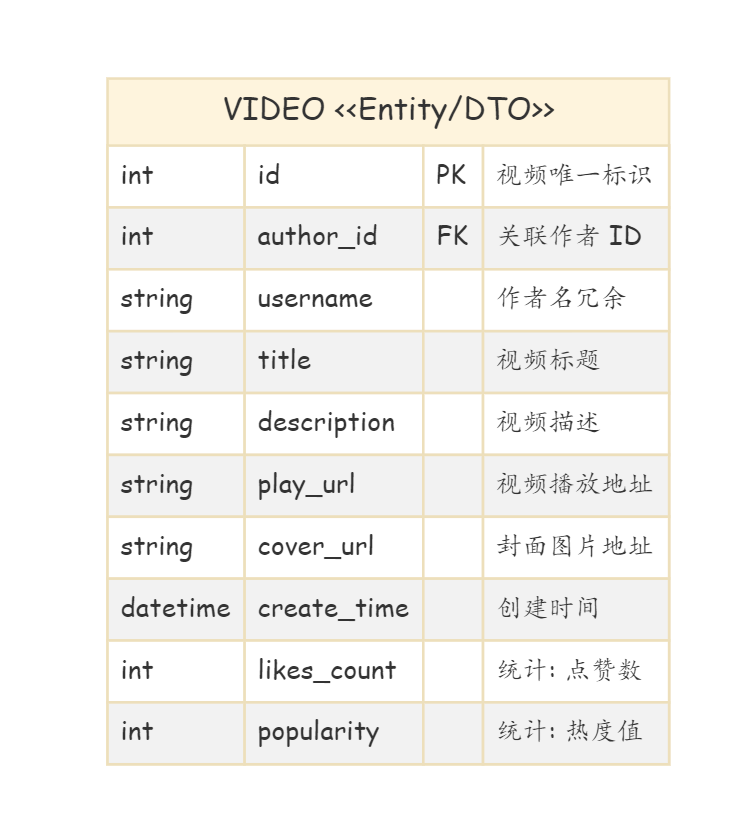
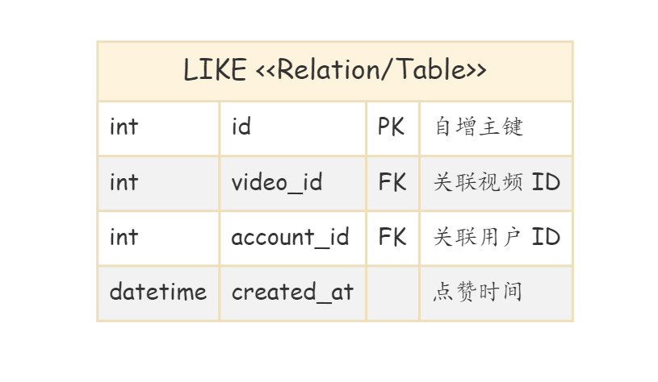
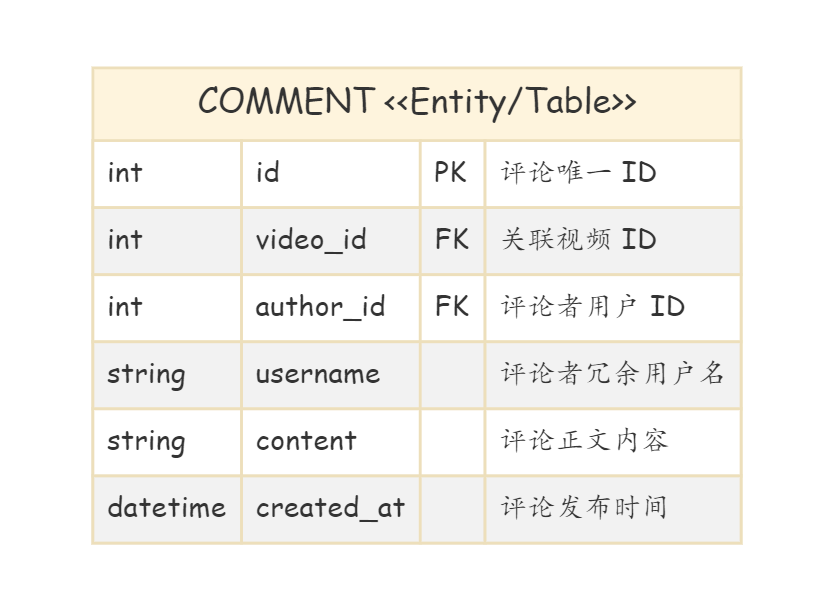
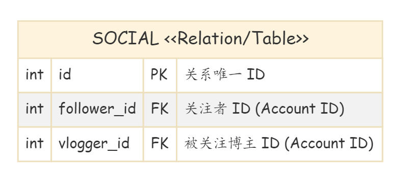
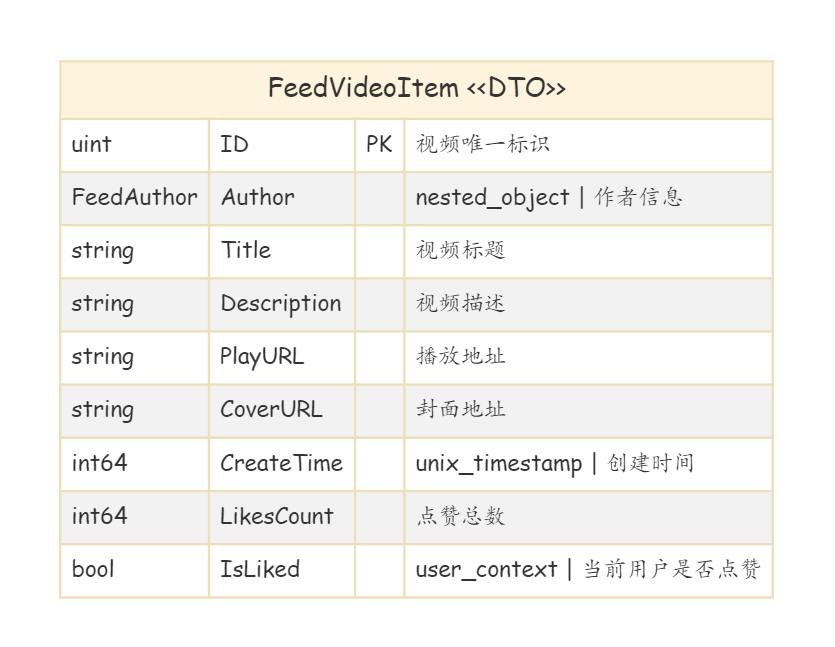
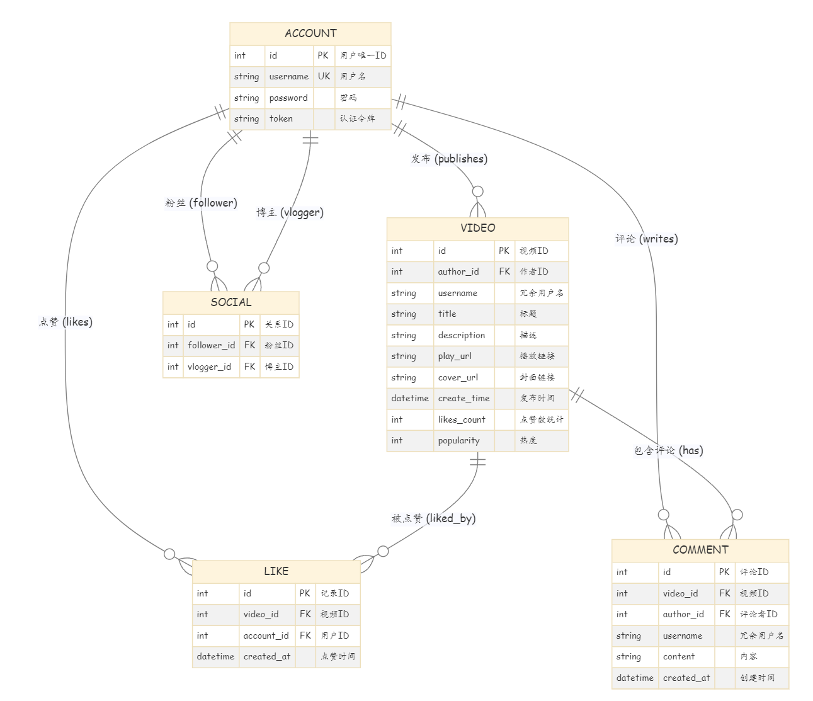
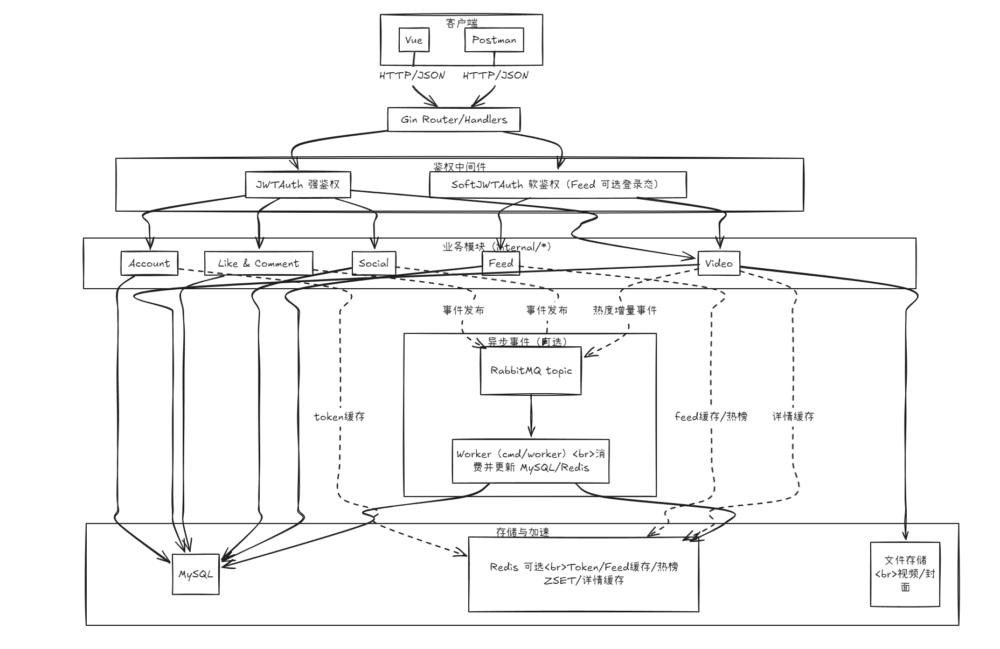
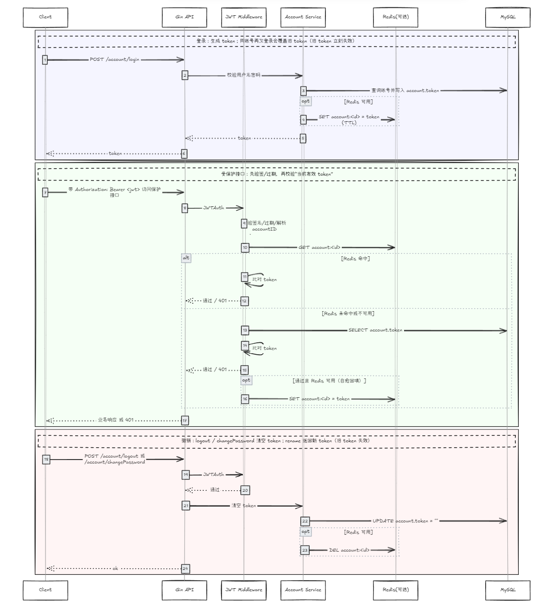
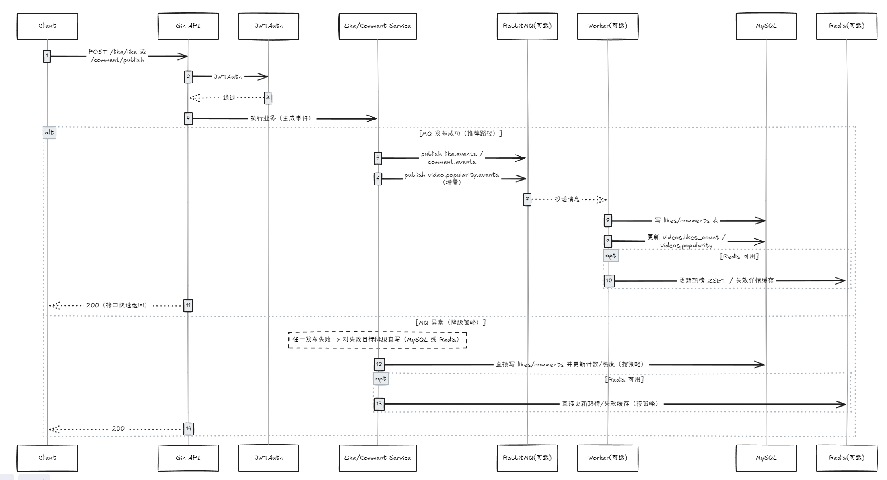

# feedsystem_video_go

> 项目介绍：本项目是一款由Go开发的高性能短视频Feed流系统，提供账号、视频、点赞、评论、关注（Social）与 Feed 等接口，并用Redis和RabbitMQ优化，同时编写了docker文件使其方便部署。

# 技术栈

| 维度            | 组件/工具                    | 说明                                                         |
| --------------- | ---------------------------- | ------------------------------------------------------------ |
| 开发语言        | Go (Golang)                  | 后端核心业务逻辑实现（API + Worker）。                       |
| Web 框架        | Gin                          | HTTP 路由注册、参数绑定、统一返回与中间件链（JWTAuth / SoftJWTAuth）。 |
| ORM 框架        | GORM                         | 模型定义、CRUD、启动时 AutoMigrate 自动迁移表结构。          |
| 持久化          | MySQL                        | 存储 `Account / Video / Like / Comment / Social` 五张核心表及相关统计字段（如 likes_count、popularity）。 |
| 缓存/排行榜     | Redis（可选）                | Token 校验缓存（`account:<id>`）、Feed 匿名流缓存、视频详情缓存、热榜 ZSET（滑动窗口聚合/快照分页）。 |
| 消息队列        | RabbitMQ（可选）             | Topic 事件总线：`like.events`、`comment.events`、`social.events`、`video.popularity.events`；由 Worker 异步消费写 MySQL/Redis，支持异常降级直写。 |
| 异步执行        | Worker（Go）                 | `cmd/worker`：LikeWorker/CommentWorker/SocialWorker/PopularityWorker，异步落库、更新计数/热度、更新热榜与缓存失效。 |
| 文件存储        | Local Disk（可替换对象存储） | 视频与封面文件存放本地目录（生产可替换为 OSS/S3/MinIO）。    |
| 容器化/依赖编排 | Docker / Docker Compose      | 一键拉起 RabbitMQ 等依赖（可配合 `./start.sh`），便于本地联调与部署环境一致性。 |
| 接口调试        | Postman Collection           | `test/postman.json`：预置变量、批量跑接口与部分断言脚本。    |
| 前端            | Vue + Vite                   | 前端工程 `frontend/`，通过 Vite 代理 `/api` 对接后端。       |

## 模块设计

### 用户系统

#### 表设计

#### 相关方法

| 层级              | 方法/路由                                                    | 输入 -> 输出                                   | 存储(MySQL/Redis) | 核心说明                                                     |
| ----------------- | ------------------------------------------------------------ | ---------------------------------------------- | ----------------- | ------------------------------------------------------------ |
| Handler           | POST `/account/register`                                     | `{username,password}` -> `{account}`           | MySQL ✅           | 注册账号；密码 bcrypt 哈希入库。                             |
| Handler           | POST `/account/login`                                        | `{username,password}` -> `{token}`             | MySQL ✅ / Redis ✅ | 登录成功写 `account.token`；Redis 写 `account:<id>` TTL 24h（可选）。 |
| Handler           | POST `/account/changePassword`                               | `{username,old_password,new_password}` -> `{}` | MySQL ✅ / Redis ✅ | 修改密码成功后清空 token（强制下线）；删除 Redis token 缓存。 |
| Handler           | POST `/account/findByID`                                     | `{id}` -> `{account}`                          | MySQL ✅           | 按 ID 查用户。                                               |
| Handler           | POST `/account/findByUsername`                               | `{username}` -> `{account}`                    | MySQL ✅           | 按用户名查用户（前端常用保存 accountId/vloggerId）。         |
| Handler           | POST `/account/rename`                                       | `{new_username}` -> `{token}`                  | MySQL ✅ / Redis ✅ | 改名并**生成新 JWT**；旧 token 立即失效；更新 DB/Redis。     |
| Handler           | POST `/account/logout`                                       | `{}` -> `{}`                                   | MySQL ✅ / Redis ✅ | 清空 DB token 并删除 Redis token；旧 token 立即失效。        |
| Service(建议命名) | `Register/Login/ChangePassword/FindByID/FindByUsername/Rename/Logout` | -                                              | -                 | 对应 Handler 的业务实现。                                    |

### 视频系统

#### 表设计

#### 相关方法

| 层级              | 方法/路由                          | 输入 -> 输出                                          | 存储(MySQL/Redis) | 核心说明                                           |
| ----------------- | ---------------------------------- | ----------------------------------------------------- | ----------------- | -------------------------------------------------- |
| Handler           | POST `/video/publish`              | `{title,description,play_url,cover_url}` -> `{video}` | MySQL ✅           | JWT 保护；写视频记录；热度字段初始化。             |
| Handler           | POST `/video/listByAuthorID`       | `{author_id}` -> `{videos[]}`                         | MySQL ✅           | 作者主页视频列表。                                 |
| Handler           | POST `/video/getDetail`            | `{id}` -> `{video_detail}`                            | MySQL ✅ / Redis ✅ | 视频详情可走缓存（Redis 可选）；变更时需失效。     |
| Service(建议命名) | `Publish/ListByAuthorID/GetDetail` | -                                                     | -                 | `GetDetail`：优先 Redis，未命中回源 MySQL 后回填。 |

### 点赞系统

#### 表设计

#### 相关方法

| 层级              | 方法/路由             | 输入 -> 输出                 | 存储(MySQL/Redis/MQ)           | 核心说明                                                     |
| ----------------- | --------------------- | ---------------------------- | ------------------------------ | ------------------------------------------------------------ |
| Handler           | POST `/like/isLiked`  | `{video_id}` -> `{is_liked}` | MySQL ✅                        | JWT 保护；判断当前用户是否点赞该视频。                       |
| Handler           | POST `/like/like`     | `{video_id}` -> `{}`         | MQ ✅(可选) / MySQL ✅ / Redis ✅ | 优先发布 `like.events`（`like.like`）与热度增量事件；发布失败降级直写。 |
| Handler           | POST `/like/unlike`   | `{video_id}` -> `{}`         | MQ ✅(可选) / MySQL ✅ / Redis ✅ | 同上（`like.unlike`）；更新 likes_count 与 popularity。      |
| Service(建议命名) | `IsLiked/Like/Unlike` | -                            | -                              | 与 MQ 降级策略绑定：任一发布失败则对失败目标直写。           |

### 评论系统

#### 表设计

#### 相关方法

| 层级              | 方法/路由                | 输入 -> 输出                        | 存储(MySQL/Redis/MQ)           | 核心说明                                                     |
| ----------------- | ------------------------ | ----------------------------------- | ------------------------------ | ------------------------------------------------------------ |
| Handler           | POST `/comment/listAll`  | `{video_id}` -> `{comments[]}`      | MySQL ✅                        | 列出某视频全部评论。                                         |
| Handler           | POST `/comment/publish`  | `{video_id,content}` -> `{comment}` | MQ ✅(可选) / MySQL ✅ / Redis ✅ | 发布 `comment.events`（`comment.publish`）并触发 `popularity + 1`；发布失败降级直写。 |
| Handler           | POST `/comment/delete`   | `{comment_id}` -> `{}`              | MQ ✅(可选) / MySQL ✅ / Redis ✅ | 仅作者可删；发布 `comment.delete`；必要时失效缓存/更新热度。 |
| Service(建议命名) | `ListAll/Publish/Delete` | -                                   | -                              | 评论写入与热度增量解耦到 MQ/Worker。                         |

### 关注系统

#### 表设计

#### 相关方法

| 层级              | 方法/路由                                        | 输入 -> 输出                       | 存储(MySQL/MQ)       | 核心说明                                     |
| ----------------- | ------------------------------------------------ | ---------------------------------- | -------------------- | -------------------------------------------- |
| Handler           | POST `/social/follow`                            | `{vlogger_id}` -> `{}`             | MQ ✅(可选) / MySQL ✅ | JWT 保护；关注事件可异步写入。               |
| Handler           | POST `/social/unfollow`                          | `{vlogger_id}` -> `{}`             | MQ ✅(可选) / MySQL ✅ | 取关事件可异步写入。                         |
| Handler           | POST `/social/getAllFollowers`                   | `{vlogger_id?}` -> `{followers[]}` | MySQL ✅              | vlogger_id 可空：默认当前登录账号。          |
| Handler           | POST `/social/getAllVloggers`                    | `{follower_id?}` -> `{vloggers[]}` | MySQL ✅              | follower_id 可空：默认当前登录账号。         |
| Service(建议命名) | `Follow/Unfollow/GetAllFollowers/GetAllVloggers` | -                                  | -                    | follow/unfollow 可走 MQ 异步，异常降级直写。 |

### Feed系统

#### 返回结构体设计，方便前端渲染。

#### 相关方法

| 层级              | 方法/路由                                                    | 输入 -> 输出                                                 | 存储(MySQL/Redis) | 核心说明                                                     |
| ----------------- | ------------------------------------------------------------ | ------------------------------------------------------------ | ----------------- | ------------------------------------------------------------ |
| Handler           | POST `/feed/listLatest`                                      | `{limit,latest_time}` -> `{videos[], next_time}`             | MySQL ✅ / Redis ✅ | 匿名流可缓存（短 TTL）；`latest_time` 游标分页。             |
| Handler           | POST `/feed/listLikesCount`                                  | `{limit,likes_count_before,id_before}` -> `{videos[], next_likes_count_before,next_id_before}` | MySQL ✅           | 复合游标分页：`likes_count + id` 保证稳定不重不漏。          |
| Handler           | POST `/feed/listByPopularity`                                | `{limit,as_of,offset}` -> `{videos[], as_of,next_offset}`    | Redis ✅ / MySQL ✅ | 热榜优先 Redis ZSET（快照+offset）；Redis 不可用回退 MySQL/简化逻辑。 |
| Handler           | POST `/feed/listByFollowing`                                 | `{limit}` -> `{videos[]}`                                    | MySQL ✅           | 需要登录（关注流）；按关注关系聚合视频。                     |
| Service(建议命名) | `ListLatest/ListLikesCount/ListByPopularity/ListByFollowing` | -                                                            | -                 | `ListByPopularity`：滑动窗口聚合 + 快照分页；`ListLatest`：匿名缓存。 |

### 各个模块的关系

## Redis优化部分

| 业务模块                | 数据类型 | Key 模式                                          | Value 内容                        | TTL（有效期） | 备注 / 高可用策略                                            |
| ----------------------- | -------- | ------------------------------------------------- | --------------------------------- | ------------- | ------------------------------------------------------------ |
| 鉴权 Token              | STRING   | `account:<accountID>`                             | `jwt_token`                       | 24h           | **自愈机制**：鉴权优先查 Redis；未命中/失败回退 MySQL 校验 `account.token`；通过后回填 Redis。 |
| Feed 匿名流缓存         | STRING   | `feed:listLatest:limit=<n>:before=<u>`            | `ListLatestResponse`（JSON）      | 5s            | **防击穿**：缓存未命中时用 `lock:<cacheKey>`（`SETNX`）互斥回源（如 500ms/短等待），避免并发打爆 DB。 |
| Feed 关注流缓存（可选） | STRING   | `feed:listByFollow:limit=<n>:uid=<id>:before=<u>` | `ListByFollowResponse`（JSON）    | 5s            | **防击穿**：同样使用 `lock:<cacheKey>` 互斥回源（短等待/快速失败兜底）。 |
| 视频详情缓存            | STRING   | `video:detail:id=<videoID>`                       | `Video`（JSON）                   | 5m            | **一致性**：视频删除/更新时主动 `DEL`；**防击穿**：详情回源可加互斥锁（如 2s 锁 TTL）。 |
| 实时热榜窗              | ZSET     | `hot:video:1m:<yyyyMMddHHmm>`                     | member=`videoID` score=`热度增量` | 2h            | **滚动窗口**：按分钟分桶写入；用 `ZINCRBY` 更新热度，减少单 Key 竞争。 |
| 热榜快照                | ZSET     | `hot:video:merge:1m:<as_of>`                      | `ZUNIONSTORE` 合并结果            | 2m            | **聚合查询**：合并最近 60 个分钟窗生成快照；快照分页读取，保证分页一致性与稳定性。 |

## RabbitMQ优化部分

| 业务模块 | Exchange / RoutingKey                                 | 事件类型      | Payload（示例字段）                                 | 消费者（Worker）   | 失败/降级策略                                                |
| -------- | ----------------------------------------------------- | ------------- | --------------------------------------------------- | ------------------ | ------------------------------------------------------------ |
| 点赞     | `like.events` / `like.like` `like.unlike`             | 点赞/取消点赞 | `{account_id, video_id, ts}`                        | `LikeWorker`       | 发布失败：对失败目标降级直写（MySQL 或 Redis）；确保 `likes` 与计数可落地。 |
| 评论     | `comment.events` / `comment.publish` `comment.delete` | 发布/删除评论 | `{account_id, video_id, comment_id?, content?, ts}` | `CommentWorker`    | 发布失败：降级直写 MySQL；热度增量事件失败则直接更新 Redis（或同步更新 popularity）。 |
| 关注     | `social.events` / `social.follow` `social.unfollow`   | 关注/取关     | `{follower_id, vlogger_id, ts}`                     | `SocialWorker`     | 发布失败：降级直写 MySQL，保证关注关系即时生效。             |
| 热度增量 | `video.popularity.events` / `video.popularity.update` | 热度更新      | `{video_id, delta, reason, ts}`                     | `PopularityWorker` | `UpdatePopularity` 发布失败：直接更新 Redis 热榜；并触发详情缓存失效（如需要）。 |

# 整体架构

# 流程图

## 整体流程图

## 核心子流程图

### 子流程 A：登录/鉴权/撤销 token

### 子流程 B：点赞/评论 + 异步落库 + 热度更新 + 降级

### 子流程 C：Feed 软鉴权 + 缓存/热榜 + 分页游标

# 亮点解析

| 维度       | 亮点名称                    | 技术实现与设计细节                                           | 业务价值与优势                                               |
| ---------- | --------------------------- | ------------------------------------------------------------ | ------------------------------------------------------------ |
| 缓存架构   | 鉴权缓存自愈机制            | 鉴权中间件优先查 Redis（`account:<accountID>`）；若失效/不可用则回退 MySQL 校验 `account.token`；通过后自动回填 Redis（自愈）。 | 兼顾高性能与鲁棒性：Redis 宕机不影响鉴权；恢复后可自动“热启动”缓存，降低 DB 压力。 |
| 缓存架构   | 分布式锁防击穿              | Feed 匿名流/视频详情等缓存未命中时，用 Redis `SETNX` 做互斥锁控制，仅允许一个请求回源构建缓存，其余等待/返回兜底结果。 | 避免热点 Key 过期瞬间大量并发回源，保护 MySQL，提升高峰期稳定性。 |
| 缓存架构   | 滑动窗口热榜快照            | 互动/热度按分钟写入 ZSET；查询时用 `ZUNIONSTORE` 聚合最近 N 个时间窗（如 60 分钟）生成“短期快照”并分页读取。 | 降低高频写 Key 竞争；利用快照保证分页一致性，减少“榜单抖动”。 |
| 缓存架构   | 主动失效一致性              | 视频删除/改名/点赞/评论导致数据变化时，主动 `DEL` 相关详情缓存、Feed 缓存或热榜相关缓存。 | 提升数据一致性与用户体验：避免看到已删除/过期/状态错误的旧数据。 |
| 分页设计   | 双字段复合游标分页          | `/feed/listLikesCount` 使用 `likes_count_before + id_before` 作为复合游标（两者一起定位下一页）。 | 解决“点赞数相同”排序不稳定问题，确保不重复、不漏数据，分页稳定可复现。 |
| 分页设计   | 快照式稳定分页              | `/feed/listByPopularity` 首次请求生成 `as_of`（分钟级快照版本），后续分页携带相同 `as_of + offset`。 | 规避热度实时变化导致的“跳页/重复/缺失”，滚动浏览更稳定。     |
| 安全鉴权   | 软硬鉴权兼容模式            | 提供 `JWTAuth`（强制拦截）与 `SoftJWTAuth`（可不带 token；带了必须合法，否则 401）。 | 既支持匿名浏览 Feed，又支持登录态个性化（如点赞/关注状态），体验与安全兼顾。 |
| 系统稳定性 | 多级存储降级设计            | Redis 为可选依赖：连接失败自动降级走 MySQL；Redis 恢复后通过请求自愈回填缓存。 | 提升环境适应性与容灾能力，基础设施异常时核心业务仍可用。     |
| 异步架构   | RabbitMQ 事件驱动解耦       | 使用 RabbitMQ topic exchanges：`like.events`、`comment.events`、`social.events`、`video.popularity.events`；后端接口仅负责发布事件，`cmd/worker` 内的 Like/Comment/Social/Popularity Worker 异步消费并更新 MySQL/Redis。 | 削峰填谷、降低接口响应时延；写扩散与热度计算解耦，提升吞吐与可维护性，便于后续扩展更多消费者（统计、风控等）。 |
| 异步架构   | MQ 异常降级直写             | 点赞/评论：尝试同时发布“写 MySQL 的队列”+“写 Redis 热度队列”；任一发布失败则对失败目标降级为直写（MySQL 或 Redis）。`UpdatePopularity` 发布失败则直接更新 Redis。 | MQ 不可用时仍能保证核心数据正确落库/可见，避免“请求成功但数据不落地”的一致性风险。 |
| 工程交付   | Docker Compose 一键依赖拉起 | 通过 `docker compose up -d rabbitmq`（或 `./start.sh` 自动拉起）快速启动 RabbitMQ 等依赖；本地环境以容器化方式对齐。 | 降低环境搭建成本，减少“在我机器上没问题”；便于 CI/本地联调/演示，提升交付效率。 |
| 工程交付   | 脚本化一键启动与可拆分运行  | `./start.sh` 默认启动后端+前端，并可用 `START_FRONTEND=0` 仅启后端；Worker 可单独运行 `go run ./cmd/worker`。 | 提升开发体验与部署灵活性：既能一键体验全链路，也能按需拆分进程满足生产部署（API/Worker 独立伸缩）。 |
| 工程质量   | 自动化基础设施              | 服务启动时执行 GORM `AutoMigrate` 自动同步 `Account/Video/Like/Comment/Social` 等表结构。 | 简化部署与迭代成本，“开箱即用”，保证 Schema 与模型一致性。   |
